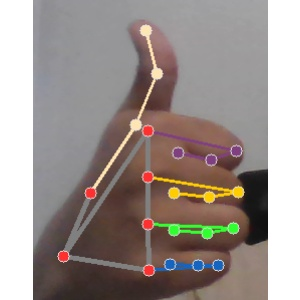
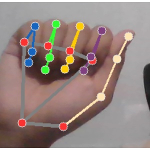
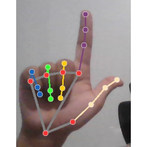
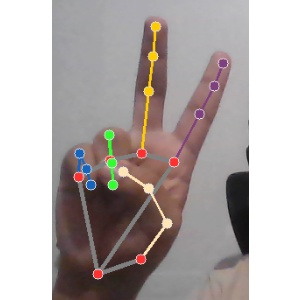

# Control de EV3 mediante Gestos de Manos 🤖👋

## 📌 Descripción del Proyecto

Sistema que controla un robot LEGO EV3 mediante reconocimiento de gestos de mano (Forward, Back, Left, Right) usando **TensorFlow** y comunicación via WebSockets.

### Estructura del Proyecto

#### **Cliente (EV3)**

- **Hardware**: LEGO EV3 con `ev3dev2` como sistema operativo.
- **Conexión**: SSH via Bluetooth (red PAN).
- **Archivos**:
  - `main.py`: Programa principal (gestión de sockets y comandos).
  - `movement.py`: Lógica de movimiento del EV3 (motores/sensores).

#### **Servidor (Procesamiento)**

- **Flujo**:
  1. Captura de imágenes (`collect.py`) con MediaPipe y OpenCV (300x300px).
  2. Entrenamiento del modelo (`train.py`) con TensorFlow (CNN).
  3. Servidor WebSocket (`main.py`) que envía predicciones al EV3.
- **Archivos auxiliares**:
  - `test.py`: Pruebas de conexión.
  - `view.py`: Ejemplo de captura con OpenCV.

## 🛠️ Instalación

### Requisitos para el Servidor

```bash
# Librerías principales (Python 3.10+)
pip install tensorflow==2.18 opencv-python==4.11.0 mediapipe==0.10.21 numpy==1.26.4
```

### Configuración del EV3

1. **Conexión Bluetooth**:
   - Emparejar EV3 con el computador.
   - Conectar via SSH:
     ```bash
     ssh robot@ev3dev
     ```
   - Ingresar contraseña: (`maker`)

## 🚀 Uso

### 1. Entrenar el Modelo

```bash
# Generar dataset (ejecutar antes de entrenar)
python collect.py
```

Para guardar las imagenes es necesario presionar la tecla "S"

```bash
# Entrenar modelo (guardado en Models/)
python train.py
```

Adicionalmente añado el modelo que yo he hecho.

https://www.kaggle.com/models/candelasmezauriel/hand-gesture-detection

### 2. Iniciar Servidor

```bash
python main.py  # Inicia servidor WebSocket
```

### 3. Ejecutar Cliente en EV3

```bash
cd client
python3 main.py  # Desde la terminal del EV3
```

## 📂 Estructura de Directorios

```
.
├── client/
│   ├── main.py          # Cliente principal
│   └── movement.py      # Control de motores
├── server/
│   ├── collect.py       # Captura de imágenes
│   ├── train.py         # Entrenamiento
│   ├── main.py          # Servidor WebSocket
│   ├── test.py          # Pruebas
│   └── view.py          # Ejemplo OpenCV
├── Datasets/            # Imágenes para entrenamiento
├── Models/              # Modelos entrenados
└── images/              # Capturas para documentación
```

## 🖼️ Gestos Soportados

| Gestos  | Imagen de Referencia           | Comando EV3     |
| ------- | ------------------------------ | --------------- |
| Forward |  | Avanzar         |
| Back    |        | Retroceder      |
| Left    |        | Girar izquierda |
| Right   |      | Girar derecha   |

## 📝 Notas Adicionales

- El dataset debe contener al menos **200 imágenes por gesto** para un buen entrenamiento (En mi caso usé **410**).
- Para mejor rendimiento, usa iluminación uniforme al capturar gestos y realizar distintas poses en diferentes fondos.
